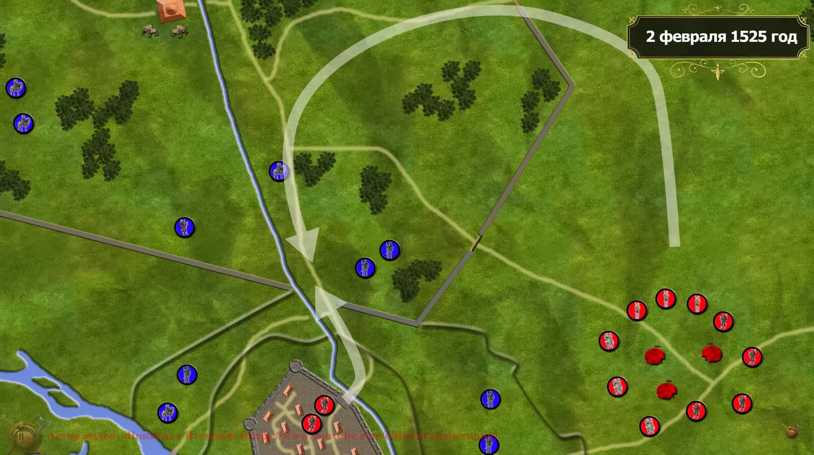
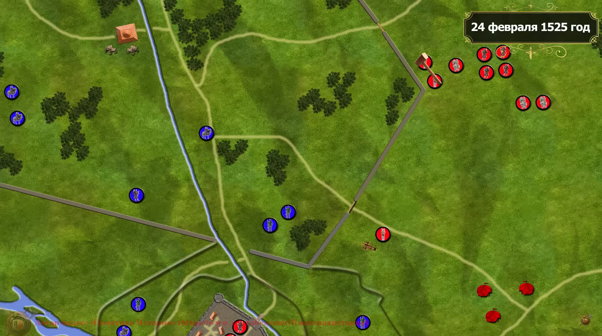
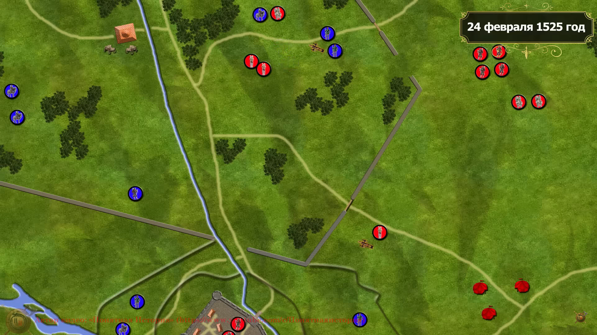
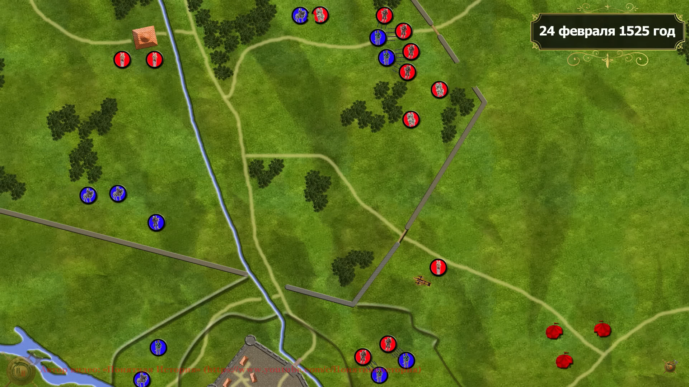
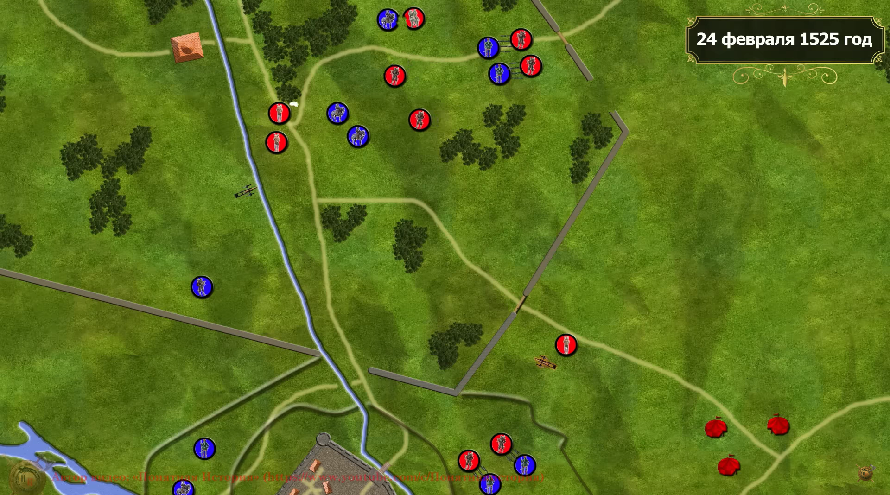
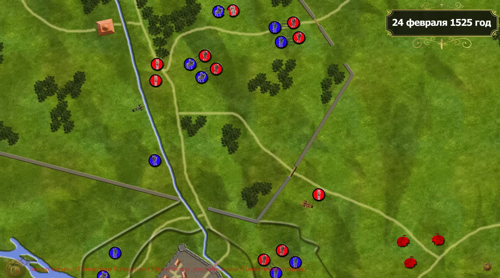
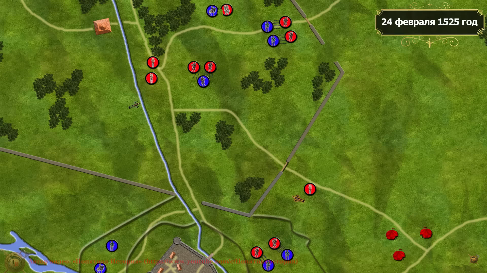
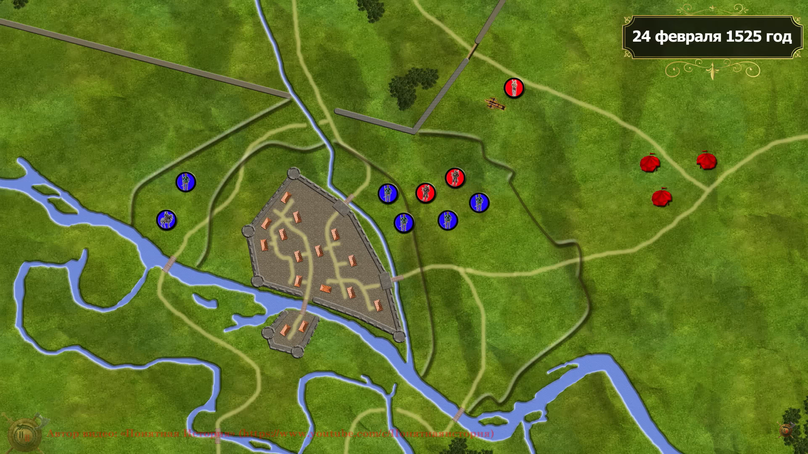

Армия Франции состовляла :
 
 - 7000 швейцарских пехотинцев
 - 4000 ландкнехтов из чёрной банды
 - 4000 французких пехотинцев
 - 2000 итальянских пехотинцев

 - 4000 Жандармов
 - 2000 лёгких всадников

Армия Испании состовляла :

 - 12000 ландскнехтов
 - 5000 испанских пехотинцев
 - 3000 итальянских пехотинцев

 - 1500 лёгких всадников 
 - 1200 тяжёлых всадников

Гарнизон Павии состовлял :

 - 7000 ландскнехтов
 - 3000 испанских пехотинцев

Французкая тактика была оборонительной :

они имели меньше войск

также они расчитовали что испанцев кончется деньги на оплату наёмников и тогда взбунтовавшиеся наёмники откроют врата города

что бы недопустить этот вариант развития событий императорские войска решили прорваться к Павии

большая часть армии выдвинулась с северному входу в парк Мирабело

и небольшой отряд начал обстреливать врага на юге отвлекая его

к 4 часам кавалерия Французов обноружила испанских мушкетёров 

не рискнув вступить в бой они отправили гонцов к королю и швейцарцам

Швейцарцы атаковали и захватили пушки но среди их не было артилеристов

Гарнизон Павии начал вылоску в 6 часов утра

в 7 часов утра в парк вошли ландкнехты а мушкетёры разгабили обоз у охотничего дворца и начали бой против швейцрцов

король разбил имперскую кавалерию

однако жандармы короля заняли невыгыдную позицию 

и они были атакованны ландкнехтоми и окружены  и х также обстреляли мушкетёры

они были полностью уничтожены а король попал в плен

4000 ланскнехтов из чёрной банды пытались спасти короля

Имперские Ландскнехты считали их предателями  потому их поностью уничтожили

к этому моменту Швейцарцы были опрокинуты численно превосходящих ландскнехтов и начали отходить

тем временевторой отряд Швейцарцев сражался с гарнизоном Павии но увидев бегущих товарищей они сами бежали

на переправе многие утонули 

герцог аласонский после этого бежал с арьергардом
